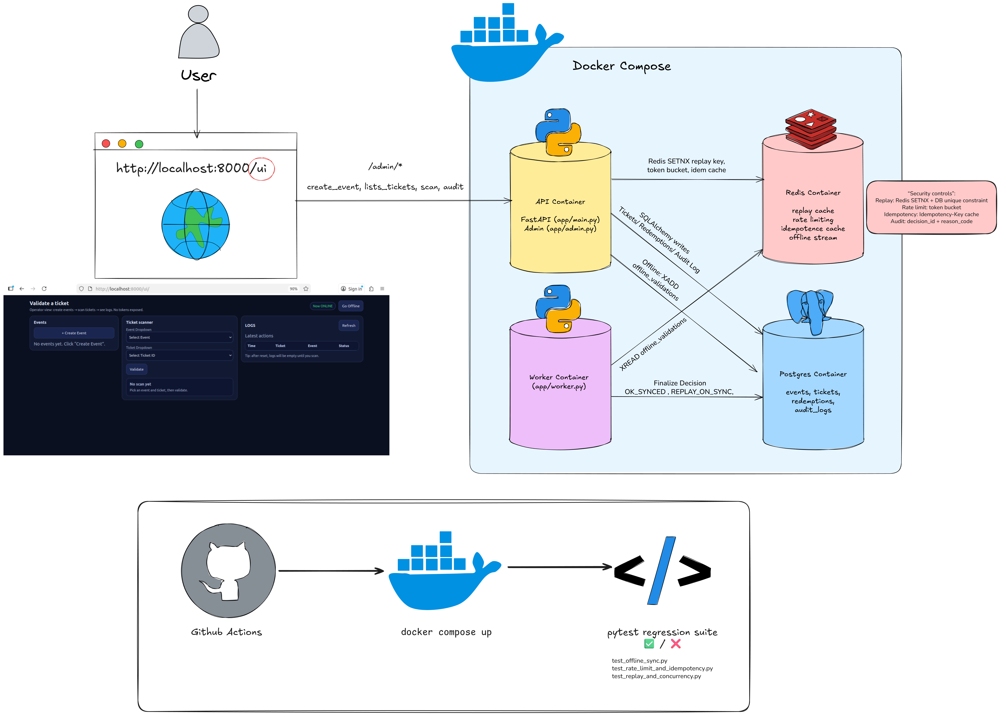
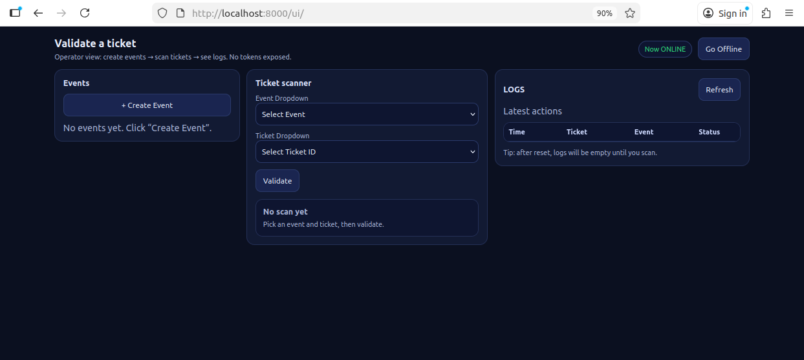

# Ticketing Security Gate (DevSecOps project)

A ticket validation service that simulates **game-day scanning** with the following security measures:
- **One-time use** (replay protection)
- **Rate limiting / bot resistance**
- **Idempotence safety**
- **Offline scanning + store-and-forward sync**
- **Full audit logging** (who/what/when/why)
- **Security regression tests + CI** (GitHub Actions)

This mirrors real operational constraints in ticketing: poor connectivity, fraud/replay attempts, burst traffic, and the need for auditable decisions.

---


## Demo Video
[Demo Video showing security features - Ticketing Security Gate](https://drive.google.com/file/d/1BLjN4M_Zax5RFGI45avuEAdBdvUixjwu/view)


---

## Architecture



---

## Quickstart

### Configure and Run Environment

```
git clone https://github.com/haahuss/Ticketing-Security-Gate.git
cd Ticketing-Security-Gate/  

cp .env.example .env  
docker compose up -d --build  
```


```
OPERATOR UI
http://localhost:8000/ui

OPENAPI
http://localhost:8000/openapi.json
```

_To reset environment, run `docker compose down -v` and then run the above docker command again._




---


## Automated Security Testing

**Rate-limit test**  
By default, the code set the rate limit to 10 req/min.  
```
bash scripts/ratelimit_test.sh
```

**Run full regression suite:**
```
docker compose exec -T api pytest -q
```

---

## Manual Security Checks

1. Create an Event and set the number of tickets.
2. Select a ticket and validate it. You should see an Approved message.

### Replay Protection
3. Scan the same ticket again. It should be rejected.

### Offline Scanning
4. Toggle into offline mode. This simulates offline scanning of tickets. Try to scan a new ticket. You should see a PENDING_SYNC message. If you toggle back online (simulating coming back online), you should see a new ACCEPTED message pop up in the logs.
5. You can try the above with an already redeemed ticket. Toggle into offline mode and then scan a "redeemed" ticket. You should see PENDING_SYNC and then a REJECTED message in the logs. 
